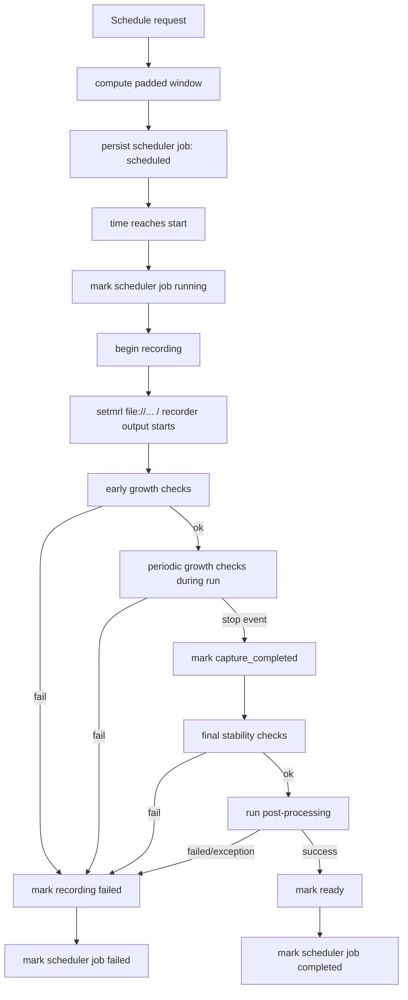

# Recorder Design and Code Flow

Status: current implementation reference
Date: 2026-05-23

This document is a practical map of how recording-related code currently works in ccatv, where state is stored, and how to extend it into a full recorder runtime without losing architectural continuity.

## Goals

1. Capture the current architecture in one place.
2. Explain exact code flow for startup, scheduling, recording state updates, post-processing, and file health checks.
3. Make next-phase implementation easier (full recorder orchestration, timers, retries, subprocess integration).

## System Overview

Today, the recorder-related stack has five key layers:

1. Settings and policy configuration.
2. App bootstrap and dependency wiring.
3. Persistence schema and store APIs.
4. Recorder service logic and state transitions.
5. Tests that lock behavior.

Core files:

- `src/ccatv/settings.py`
- `src/ccatv/app/bootstrap.py`
- `src/ccatv/storage/schema.py`
- `src/ccatv/storage/state_store.py`
- `src/ccatv/tvrecorder/service.py`
- `src/ccatv/tvrecorder/postprocess.py`
- `tests/test_settings.py`
- `tests/tvrecorder/test_service.py`
- `tests/app/test_bootstrap.py`

## Data Model and Persistence

### Database initialization

Database setup runs via:

1. `initialize_database(path)` in `src/ccatv/storage/schema.py`
2. `apply_migrations(connection)` applies missing schema versions atomically.

Current migration set:

1. v1: base recorder/scheduler tables (`recordings`, `scheduler_jobs`) + `schema_migrations`
2. v2: EPG channel/program/broadcast tables
3. v3: ingest run tracking/checkpoints

### Recorder and scheduler tables

The recorder feature currently uses:

1. `recordings`
- `id`
- `channel_name`
- `output_path`
- `state`
- `started_at_utc`
- `ended_at_utc`

2. `scheduler_jobs`
- `id`
- `channel_name`
- `start_at_utc`
- `duration_seconds`
- `state`

### Store abstraction

`PersistenceStore` in `src/ccatv/storage/state_store.py` is the write/read boundary used by recorder service logic.

Recording APIs:

1. `create_recording(...)`
2. `get_recording(id, required=...)`
3. `list_recordings()`
4. `update_recording_state(...)`

Scheduler APIs:

1. `create_scheduler_job(...)`
2. `get_scheduler_job(id, required=...)`
3. `list_scheduler_jobs()`
4. `update_scheduler_job_state(...)`

Important detail:

`update_recording_state` supports a sentinel (`_UNCHANGED`) for `ended_at_utc`, so some state transitions can update only `state` and preserve existing end timestamps.

## Settings and Policies

`AppSettings` in `src/ccatv/settings.py` centralizes environment loading and validation.

### Recorder policy settings

Padding:

1. `recording_pre_start_seconds` (default `120`)
2. `recording_post_finish_seconds` (default `900`)

File health checks:

1. `recording_early_growth_checks` (default `3`)
2. `recording_early_growth_interval_seconds` (default `2.0`)
3. `recording_periodic_growth_checks` (default `1`)
4. `recording_periodic_growth_interval_seconds` (default `30.0`)
5. `recording_growth_min_bytes` (default `1`)
6. `recording_final_stability_checks` (default `2`)
7. `recording_final_stability_interval_seconds` (default `2.0`)

Validation behavior:

1. Check counts and byte thresholds are positive (`>= 1`).
2. Intervals are non-negative (`>= 0`).
3. Pre/post padding are non-negative (`>= 0`).
4. Invalid values fall back to defaults.

## Bootstrap Wiring

`bootstrap_app()` in `src/ccatv/app/bootstrap.py` constructs one `AppContext` that wires runtime dependencies.

It creates:

1. `DvbCtrlClient`
2. `DvbStreamerManager`
3. `WritePreflightChecker`
4. `PersistenceStore` (with initialized DB)
5. `TvRecorderService`

`TvRecorderService` is created with:

1. `dvbctrl` client dependency
2. `persistence`
3. `health_policy` from settings
4. `padding_policy` from settings
5. `post_processor` explicitly set to `NoOpPostProcessingRunner`

This means recorder behavior is policy-driven at startup without hardcoding check cadence in service call sites.

## Recorder Service Responsibilities

`TvRecorderService` in `src/ccatv/tvrecorder/service.py` currently owns five distinct concerns.

### 1. Dvbctrl command facade

Methods:

1. `run_raw`, `run`
2. `select_service`, `current`, `stats`, `festatus`
3. Parsed snapshots:
- `current_status`
- `stats_snapshot`
- `frontend_status`

### 2. Scheduler lifecycle

States used:

1. `scheduled`
2. `running`
3. `completed`
4. `failed`

Methods:

1. `schedule_recording(...)`
2. `mark_scheduler_job_running(...)`
3. `mark_scheduler_job_completed(...)`
4. `mark_scheduler_job_failed(...)`

Padding integration:

`schedule_recording` calls `compute_padded_recording_window`, so persisted job windows already include pre-start and post-finish padding.

### 3. Recording lifecycle

States used:

1. `recording`
2. `capture_completed`
3. `post_processing`
4. `ready`
5. `failed`

Methods:

1. `begin_recording(...)`
2. `mark_recording_capture_completed(...)`
3. `start_recording_post_processing(...)`
4. `mark_recording_ready(...)`
5. `mark_recording_failed(...)`

Timestamp semantics:

1. `begin_recording` sets `started_at_utc` (now if not provided).
2. `mark_recording_capture_completed` sets `ended_at_utc` (now if not provided).
3. `mark_recording_failed`:
- preserves existing `ended_at_utc` if already present
- otherwise sets `ended_at_utc` to now

### 4. Post-processing execution hook

Protocol and DTOs live in `src/ccatv/tvrecorder/postprocess.py`:

1. `PostProcessingRunner`
2. `PostProcessingRequest`
3. `PostProcessingResult`
4. `NoOpPostProcessingRunner`

Service execution path:

`run_recording_post_processing(recording_id)`:

1. set state to `post_processing`
2. call runner `.run(...)`
3. if success -> `ready`
4. if runner returns failure -> `failed`
5. if runner raises -> mark `failed` and re-raise exception

This is where commskip, cleanup, remux, transcode, metadata tagging, etc. can be plugged in.

### 5. File growth and final stability checks

Low-level methods:

1. `verify_recording_output_growth(...)`
- confirms file exists
- checks growth across N intervals
- requires at least one growth event meeting `min_growth_bytes`
- marks `failed` on missing file/no growth

2. `verify_recording_output_stable_after_stop(...)`
- confirms file exists
- checks size stays unchanged across N intervals
- marks `failed` if file changes or disappears

Policy wrappers:

1. `verify_recording_output_growth_early(...)`
2. `verify_recording_output_growth_periodic(...)`
3. `verify_recording_output_stable_after_stop_default(...)`

These wrappers use configured defaults from `RecordingHealthCheckPolicy`.

## End-to-End Flow (Current Building Blocks)

The project does not yet have a single long-running recording orchestrator loop. Instead, all required primitives are now present.

A typical orchestrated flow would be:

## Code Flow by Method (Reference)

### Scheduling

1. caller -> `TvRecorderService.schedule_recording(...)`
2. service -> `compute_padded_recording_window(...)`
3. service -> `PersistenceStore.create_scheduler_job(...)`

### Recording start

1. caller -> `begin_recording(...)`
2. service -> `PersistenceStore.create_recording(...)`

### Early detection of recorder/filesystem errors

1. caller -> `verify_recording_output_growth_early(...)`
2. service -> growth check loop
3. failure -> `mark_recording_failed(...)`

### Ongoing monitoring

1. caller (periodic timer) -> `verify_recording_output_growth_periodic(...)`
2. same failure semantics as early check

### Capture stop confirmation

1. caller -> `mark_recording_capture_completed(...)`
2. caller -> `verify_recording_output_stable_after_stop_default(...)`
3. failure -> `mark_recording_failed(...)`

### Post-capture work

1. caller -> `run_recording_post_processing(...)`
2. service -> runner
3. state moves to `ready` or `failed`

## Design Choices and Rationale

1. Service methods return records, not booleans.
- Makes state transitions explicit and testable.

2. Fail-fast on file health anomalies.
- Missing output file or no growth quickly marks failure.

3. Separate growth and stability checks.
- Growth while running and stability after stop are different failure modes.

4. Pluggable post-processing runner.
- Keeps external tooling (commskip/transcode/etc.) decoupled from domain logic.

5. Policy objects for behavior tuning.
- Avoids hardcoded timing values in business logic.

## Test Coverage Map

Primary tests live in:

1. `tests/tvrecorder/test_service.py`
2. `tests/test_settings.py`
3. `tests/app/test_bootstrap.py`

Covered behavior includes:

1. scheduler and recording state transitions
2. failed-state timestamp semantics
3. post-processing success/failure/exception paths
4. growth/stability check pass/fail cases
5. policy wrapper behavior
6. settings defaults/overrides/fallbacks
7. bootstrap wiring

## Extension Guide for Full Recorder Runtime

When building the full recorder phase, implement an orchestrator that composes existing methods rather than rewriting state logic.

Recommended next steps:

1. Add a scheduler loop/worker that executes due jobs.
2. Integrate `setmrl file://...` and stop logic around `DvbStreamerManager`/dvbctrl commands.
3. Run `verify_recording_output_growth_early` shortly after start.
4. Run `verify_recording_output_growth_periodic` on a recurring timer during capture.
5. After stop, call `mark_recording_capture_completed` then `verify_recording_output_stable_after_stop_default`.
6. Then call `run_recording_post_processing`.
7. Keep scheduler job and recording states synchronized for success/failure surfaces.

## Operational Notes

1. Current post-processor is no-op by default; replace with a concrete runner for commskip or file cleanup.
2. Database connections are currently long-lived via bootstrap context.
3. Policy intervals permit zero for testability; production defaults are non-zero.

## Quick Cheat Sheet

Use defaults:

1. `schedule_recording(...)`
2. `mark_scheduler_job_running(...)`
3. `begin_recording(...)`
4. `verify_recording_output_growth_early(...)`
5. `verify_recording_output_growth_periodic(...)` (timer-driven)
6. `mark_recording_capture_completed(...)`
7. `verify_recording_output_stable_after_stop_default(...)`
8. `run_recording_post_processing(...)`
9. `mark_scheduler_job_completed(...)` on recorder success
10. `mark_scheduler_job_failed(...)` on recorder failure

Expected terminal states:

1. recording success: `ready`
2. recording failure: `failed`
3. scheduler success: `completed`
4. scheduler failure: `failed`
